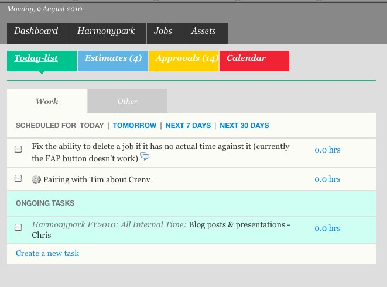

!SLIDE bullets incremental
# War Stories from a huge refactoring #
* (for fun and profit)

!SLIDE center
# Chris and Tim
# @thechrisoshow @mistertim

!SLIDE bullets incremental
# Programming is fun!
* Even when we're wasting time, we're doing work-related stuff:
* 
* 

!SLIDE bullets incremental
# This enthusiasm should infect our work
* And it does, at least to start with
* Projects have entropy
* Lets make it fun again - for both our sanity and productivity

!SLIDE bullets incremental
# We learn lots of new tricks
* But we typically wait for a new project to try them out
* Greenfield projects happen infrequently

!SLIDE bullets incremental
# How can we apply all the cool new things we learn to legacy projects?

!SLIDE 
# One teams war story #

!SLIDE center
# Creativenvironment #

!SLIDE bullets incremental
# The Scheduler #
* (aka The Black Hole of Doom)

!SLIDE bullets incremental
# Design was evolutionary
* Numerous developers over the years bringing their own ideas about how it should work

!SLIDE small
    @@@ ruby
    def schedule_task(task, args) 
      if task.should_be_forced_into_bucket?
        forced_schedule_task(task) 
      elsif args[:immediate] == true
        schedule_task_immediately(task, args)
      else
        if args[:on]
          task.fill_options ||= {}
          task.fill_options[:event_day] = 
                      args[:on]
          task.save if task.changed?
        end

        schedule_date = args[:on] || 
                          Date.today
        scheduling = schedule_task_as_best_fit(
          task, schedule_date, args[:base_time])
  
        return scheduling
      end
    end

!SLIDE smaller
    @@@ruby
    it "should create a new job scheduling for the uncanonical task, 
    removing it from its previous job scheduling. the new job 
    scheduling should have the same parent as the previous." do
      job_scheduling = JobScheduling.create(:job => @job)
      task_scheduler = TaskScheduler.new(@bucket, true, job_scheduling)
      task_2 = make_task_for_user(@user, :name => "foobar", :estimated_duration => 1.hour, :job => @job)
      task_scheduling, task_scheduling_2 = *task_scheduler.schedule_tasks([@task, task_2])
      task_scheduling.job_scheduling.should == job_scheduling
      task_scheduling_2.job_scheduling.should == job_scheduling
      job_scheduling.reload.save
      job_scheduling.should be_canonical 
      job_scheduling.should be_current_canonical

      task_3 = make_task_for_user(@user, :name => "foo", :estimated_duration => 1.hour, :job => @job)
      job_scheduling_2 = JobScheduling.create(:job => @job)
      task_scheduler_2 = TaskScheduler.new(@bucket, true, job_scheduling_2)
      task_scheduling_3 = task_scheduler_2.schedule_task(task_3, :on => Date.tomorrow)
      job_scheduling_2.save
      job_scheduling_2.should be_canonical
      job_scheduling_2.reload.should be_current_canonical
      job_scheduling_2.ancestors.should include(job_scheduling)
      job_scheduling.reload.should be_canonical
      task_scheduling.make_uncanonical!
      job_scheduling.reload.task_schedulings.should_not include(task_scheduling)
      job_scheduling.should be_canonical
      task_scheduling.reload.job_scheduling.should_not be_canonical
      job_scheduling_2.reload.should be_canonical
      job_scheduling_2.ancestors.should_not include(task_scheduling.job_scheduling)
      job_scheduling_2.ancestors.should include(task_scheduling_2.job_scheduling)
    end

!SLIDE bullets incremental
# What did we need to change and how did we change it?
* All of this sucks if you're a developer
* But the thing, incredibly, still works!
* It's difficult to persuade managers that there's anything wrong

!SLIDE bullets incremental
# Except that the app was dog slow
* This isn't premature optimisation:> 1min page load times
* with a user base of < 10
* (To be fair, this was only on one page)
* But this is something that managers and users notice!

!SLIDE bullets incremental
# These two problems are actually the same
* The hideous inefficiency was caused by the hideous convolutedness
* Therefore, anything we could do to fix it was an easy sell

!SLIDE bullets incremental
# All we care about is priority and duration
* Inserting new tasks is just calculating priority and inserting into a list
* What were we doing instead?

!SLIDE bullets incremental
# Storing the start date of every task!
* Inserting a new task means changing the records of every one that comes after
* Changing task priority happens often - it has to be quick.

!SLIDE bullets incremental
# So we rewrite the scheduler
* Management people sold on the idea
* We know roughly what we have to do

!SLIDE bullets incremental
# But...
* Our tests aren't reliable
* Scheduler code is incredibly highly coupled to the rest of the system
* How can we do this without breaking anything?

!SLIDE bullets incremental
# Cucumber
* it's great for acceptance and regression testing
* But all our tests are written by us, not users
* Don't necessarily test requirements
* Plus we're not sure if they work

!SLIDE bullets incremental
# Rewrite the features!
* Didn't take long - Day or so
* This time, we did it with stakeholders.

!SLIDE bullets incremental
# We had more than enough requirements documents
* Spreadsheets
* Flowcharts
* Diagrams

!SLIDE bullets incremental
# These actually aren't so useful
* Overspecify implementation
* Didn't specify behaviour, or clients expectations

!SLIDE bullets incremental
# User stories!
* Precisely define users expectations
* Don't specify implementation
* We are testing the criteria by which we succeed or fail

!SLIDE bullets incremental
# Universal language!
* Technique from DDD
* Make sure we're all using the same words to refer to the same thing
* Same throughout the system

!SLIDE
# Cucumber, properly this time

!SLIDE bullets incremental
# envjs is amazing

* But the capybara plugin for it isn't quite ready for prime time

!SLIDE
# Capybara's support for cucumber freaking rocks

!SLIDE
# How to turn on Selenium Testing

    @selenium <-- BOOM
    Scenario: Setting a job rate
      When I fill in "Job price" with "100.00"
      And I choose "Update all tasks"
      And I press "Save"

      Then I should see "Job rate was 
        successfully updated"

!SLIDE
# Pickle
    Given a company: "HPK" exists

    And a user "Bob" exists with email: 
      "bob@example.com", company: company "HPK", 
      state: "active", admin: true

    And a job "Speculative job" exists with 
      company: company "HPK", owner: user "Bob", 
      name: "Speculative job"    
      
      
    Then task: "Existing task" should exist with 
        role_price_in_cents: 10000

!SLIDE bullets incremental
* Allows us to concentrate on what we're trying to do, not how we're trying to achieve it
* Pickle handled setup and state assertions
* Everything else was done through the UI like a real user
   
!SLIDE
# Timecop and Chronic
    @@@ruby
    
    # Given the date is 21 June 2010
    Given /^the (date|time) is (.+)$/ do |_,s|
      Timecop.freeze(Chronic.parse(s))
    end

    # Given it's 1 week in the future
    Given /^it's (.+) in the future$/ do |s|
      Timecop.freeze(Chronic.parse("in #{s}"))
    end

!SLIDE bullets incremental
# We've now got our safety net
* But where do we start?
* Dealing with massive coupling - we're going to touch a lot of the system.
* We need some sort of plan

!SLIDE bullets incremental
# This isn't BDUF
* We've already been using the app for ages
* No UML, Suits, or Thinkpads

!SLIDE bullets incremental
# One rough schema diagram
* Takes time in the order of hours, not weeks
* We're not precious about it - just as with code
* A map for our refactoring adventures

!SLIDE bullets incremental
# Actually getting on with it, finally
* Ruthlessly deleted dead code and duplication
* We did have to add some new code, however:

!SLIDE small
# Big ole migration #

    @@@ruby
    #Create completions for all tasks marked as complete
    execute <<-SQL
      INSERT INTO completions (task_id, created_at, 
        updated_at)
      SELECT id as task_id, completed_at as created_at, 
        NOW() as updated_at from tasks
      WHERE completed_at IS NOT NULL
    SQL

!SLIDE small
# With assertions #
    @@@ruby
    assert("All users have a corresponding bucket") do
      lambda { 
        count("SELECT count(id) FROM users")
      }.equal {
        count("SELECT count(id) FROM buckets where
         owner_type = 'User'")
      }
    end

!SLIDE bullets incremental
# cap production sync:db

* Kinda like taps in heroku

!SLIDE
# Ensure the behaviour stays the same

!SLIDE bullets incremental
# Specs
* Test each unit, rather than the whole system
* Minimise setup
* Enforce contracts between classes

!SLIDE small
# Use Mocha to get rid of expensive setup and increase isolation
    @@@ruby
    before(:each) do
     Timecop.freeze(Date.parse("2010/07/27"))
     Estimate.any_instance.stubs(:duration).returns(8.hours)
     @bucket = Bucket.make
     @entry = FloatingEntry.make(:position => 5, 
        :start_on => Date.yesterday, :bucket => @bucket)
    end

    it "does not take up time before the start date" do
      @entry.time_on(date("Last friday")).should == 0
    end

!SLIDE smaller
# Use invariants to make sure you're testing the right thing
    @@@ruby
    it "won't include tasks whose start date is after the end date" do
      tuesday = date("Next Tuesday")
      @bucket.tasks_until_date(tuesday).should_not be_empty
      later_task = @bucket.tasks_until_date(tuesday).first
      later_task.start_on = date("Next Wednesday")
      later_task.save
      @bucket.tasks_until_date(tuesday).should_not \
        include(later_task)
    end

!SLIDE bullets incremental
# The rest of it was easy!
* Because our specs described the interface of our model classes, implementing them was almost a formality
* Only implemented the minimum to fulfil the interface, so code was very DRY
* Having decent cucumber coverage prevented regression

!SLIDE bullets 
# Thanks
* Questions?
* We're always on the lookout for smart people to work with
* Find us in the pub, or at {chris|tim}@harmonypark.net
